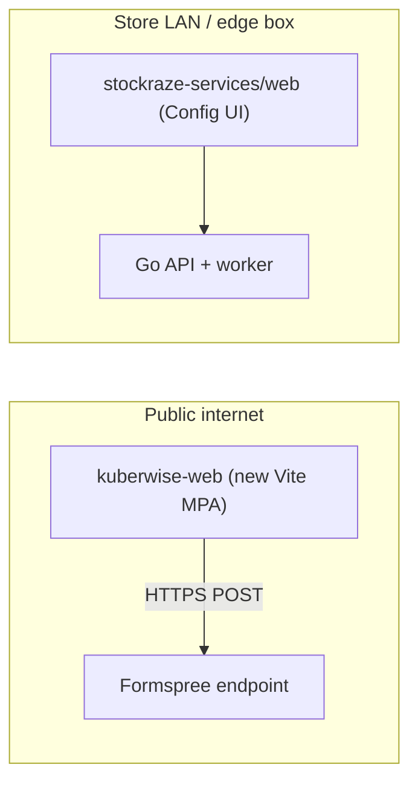

# Kuberwise marketing site — implementation plan

**Status:** approved, not yet started
**Created:** 9 September 2026
**Scope:** Kuberwise (company) and Stockraze (flagship product) marketing website

Rebuild the Kuberwise + Stockraze marketing site as a standalone Vite + React +
Tailwind project using the identical pinned stack as the Config UI (Node 16
compatible), with a lighter and more premium design, a real logo, five new
pages, and a working Formspree contact form.

---

## Decisions already made

These were settled before the plan was written, and the rest of the document
assumes them:

- **Project boundary** — a sibling Vite project, not routes inside the existing
  Config UI.
- **Design direction** — lighter and airier, and more premium (gold-forward,
  serif display headings, editorial feel).
- **Contact form** — a third-party form service (Formspree), no backend.
- **Also in scope** — more pages, and a proper Kuberwise logo.

---

## Boundary and location

A separate Vite project, deliberately outside the authenticated Config UI.

Marketing and the Config UI share no origin, no bundle, and no CI target. This
preserves the posture documented in
[stockraze-services/docs/EDGE-INSTALL.md](../stockraze-services/docs/EDGE-INSTALL.md),
where operator sessions live in `sessionStorage` on an origin with no HTTPS of
its own.

- Location: replace the current static [kuberwise-web/](./index.html) in place,
  at the workspace root, sibling to `stockraze-services/`.
- `stockraze-services/Makefile` is not modified, so `make ci` (which runs
  `web-lint web-build`) stays uncoupled.

---

## Stack, pinned to match the Config UI

Versions mirror
[stockraze-services/web/package.json](../stockraze-services/web/package.json) so
the toolchain behaves identically on Node 16.13.1:

- `vite@4.5.3`, `@vitejs/plugin-react@4.2.1`, `typescript@5.2.2`
- `react@18.2.0`, `react-dom@18.2.0`
- `tailwindcss@3.4.17`, `postcss@8.4.49`, `autoprefixer@10.4.20`
- `clsx@2.1.1`, `tailwind-merge@3.6.0`, `lucide-react@1.34.0`

All from the public npm registry. Nothing is installed until `npm install` is
approved. No form library is added: Formspree is a plain `fetch` POST.

---

## Routing: Vite multi-page, no router

One real HTML file per page rather than `react-router-dom`. Each page gets its
own static `<title>`, description, and `og:` tags in the served HTML, which is
what LinkedIn and Twitter card crawlers read. It also avoids SPA-fallback
rewrite rules on the host.

Configured via `build.rollupOptions.input` in `vite.config.ts`. Each entry is
three lines calling a shared `mount()` bootstrap; layout and content live in
shared components, so the header/footer duplication problem from the static
version goes away.

**Known limitation:** body content is still client-rendered, so it is not true
SSG. Acceptable for a brochure site, and the upgrade path is Astro once Node
moves off 16 (which is EOL).

---

## Design direction: lighter and premium

Moving away from the current dark-hero look.

- Base becomes light and airy: warm off-white surfaces, generous whitespace,
  hairline rules instead of heavy cards.
- Display headings in a serif (`Fraunces`, with a Georgia fallback); `Inter`
  retained for body and UI. Editorial contrast between the two is what carries
  the premium feel.
- Gold-forward for Kuberwise (`#B78A2B` deep, `#D8AB4A` bright); Stockraze pages
  keep the product blue `#1D4ED8` already in
  [stockraze-services/web/src/styles.css](../stockraze-services/web/src/styles.css).
- Dark sections used sparingly as one or two anchor moments, not as the hero.
- Tailwind theme extends colours as `rgb(var(--token) / <alpha-value>)`, the
  same pattern as
  [stockraze-services/web/tailwind.config.js](../stockraze-services/web/tailwind.config.js),
  with a `.theme-kuberwise` / `.theme-stockraze` class swap.

---

## Logo

Three concept directions, hand-authored as SVG and shown side by side on a
temporary `brand.html` page to choose from:

1. Ascending path ending in a value node (the current inline mark, refined).
2. Aperture "K" built from an opening vault square, referencing Kuber's
   treasury.
3. Geometric "K" with a rising bead, referencing counting and judgment.

Final deliverables for the chosen direction: `kuberwise-mark.svg`,
`kuberwise-logo.svg` (horizontal lockup), `kuberwise-logo-dark.svg`, and
`favicon.svg`. Raster PNG exports are a manual follow-up, since adding an image
toolchain like `sharp` would mean a native dependency not worth pulling in for
four files.

---

## Pages

- `index.html` — Kuberwise home. Ported from the existing copy, re-laid out for
  the lighter design.
- `stockraze.html` — product. Copy already matches the real pipeline in
  [stockraze-services/README.md](../stockraze-services/README.md); carried over
  largely intact.
- `about.html` — company story, operating beliefs, founder.
- `pricing.html` — **needs input.** Without real numbers this will be built as
  engagement models plus a "talk to us" path, leaving clearly marked
  placeholders rather than inventing figures.
- `contact.html` — contact detail plus the working form.
- `privacy.html` and `terms.html` — structured templates with explicit `TODO`
  markers. These are scaffolding for a lawyer to complete, **not usable legal
  text**.

---

## Contact form

- Plain `fetch` POST to `https://formspree.io/f/{id}`, no npm package.
- Endpoint id read from `VITE_FORMSPREE_ID` via `.env`, with a committed
  `.env.example`. Vite inlines `VITE_*` into the client bundle, so this file
  must never hold anything actually secret; that warning goes in `.env.example`
  itself.
- Honeypot field plus Formspree's own filtering for spam.
- Client-side validation with accessible error messaging, and explicit pending,
  success, and failure states.
- No submitted data is logged anywhere in the app.

**Third-party provenance worth naming:** Formspree receives prospects' names,
emails, and messages. If that is not acceptable, the fallback is a self-hosted
Go endpoint, which needs its own rate limiting and captcha.

---

## Verification

- `npm run lint` (`tsc --noEmit`) and `npm run build` must both pass.
- Every internal link and anchor resolved, the same check that passed on the
  static version.
- Keyboard navigation, visible focus states, and `prefers-reduced-motion`
  preserved from the current CSS.
- Old static `.html` and `assets/css` files removed only after the Vite build
  renders correctly.

---

## Task checklist

- [ ] **Scaffold** — Vite + React + TS + Tailwind project at `kuberwise-web/`
      with versions pinned to match the Config UI; add `package.json`,
      `vite.config.ts` (multi-page inputs), `tailwind.config.js`,
      `postcss.config.js`, `tsconfig`. Pause for approval before running
      `npm install`.
- [ ] **Design system** — CSS variable tokens, Fraunces + Inter typography
      scale, gold (Kuberwise) and blue (Stockraze) theme classes, and base
      primitives (Button, Section, Container).
- [ ] **Layout** — shared Header with mobile nav, Footer, SEO head helper, and
      the `mount()` bootstrap each page entry calls.
- [ ] **Logo** — draft three concepts as SVG, present on a temporary
      `brand.html`, then produce final mark, horizontal lockup, dark variant,
      and favicon for the chosen direction.
- [ ] **Port pages** — Kuberwise home and Stockraze product into React
      components under the new lighter design.
- [ ] **New pages** — `about.html` and `pricing.html`, pricing left as clearly
      marked placeholders pending real figures.
- [ ] **Contact form** — Formspree form with honeypot, validation, accessible
      errors, pending/success/failure states, and `VITE_FORMSPREE_ID` wired
      through `.env` plus a committed `.env.example`.
- [ ] **Legal** — `privacy.html` and `terms.html` as structured templates with
      explicit `TODO` markers and a note requiring legal review.
- [ ] **Verify** — run lint and build, verify links and anchors, check keyboard
      and reduced-motion behaviour, then remove the superseded static HTML and
      CSS.

---

## Open questions

1. **Pricing** — are there real numbers or tiers, or should the page stay as
   engagement models plus a contact path?
2. **Formspree account** — the `VITE_FORMSPREE_ID` needs to come from an account
   you create.
3. **Domains and email** — the site currently uses placeholder addresses
   (`hello@kuberwise.com`, `hello@stockraze.com`, `partners@kuberwise.com`).
4. **Detector names** — the Stockraze page describes the four detectors as
   expiry risk, slow/dead stock, allocation failure, and return-rate risk,
   inferred from the inventory columns rather than the detector source. Worth
   confirming against the code.
